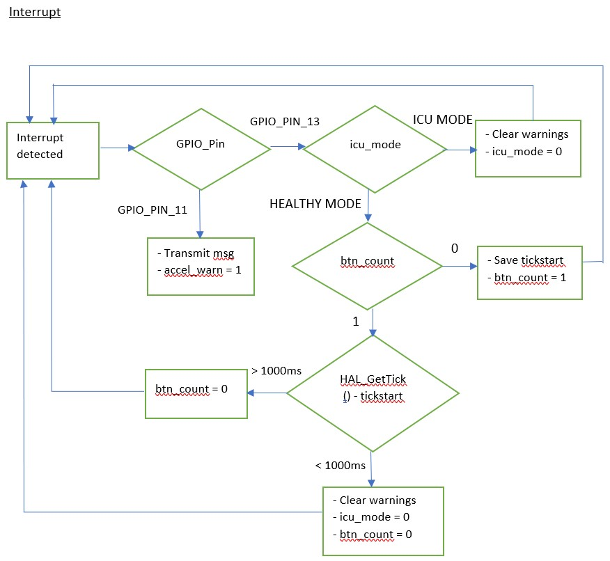
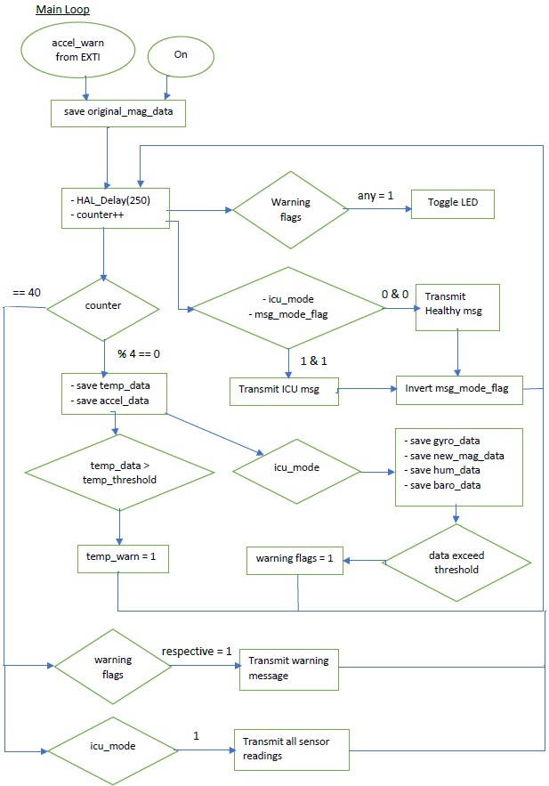
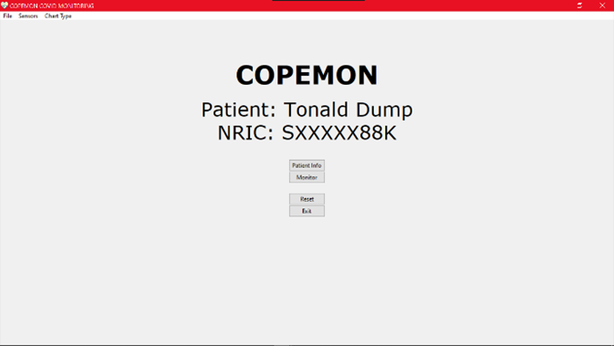
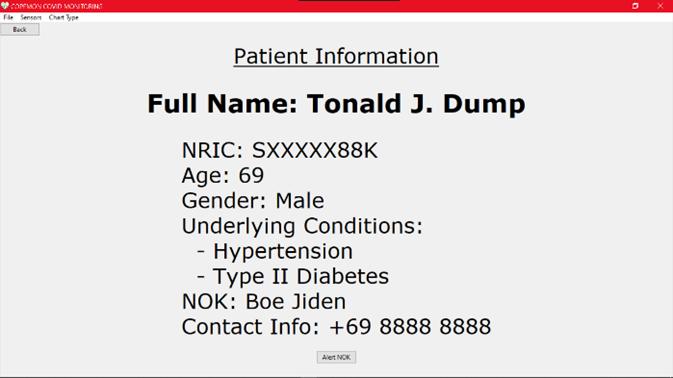
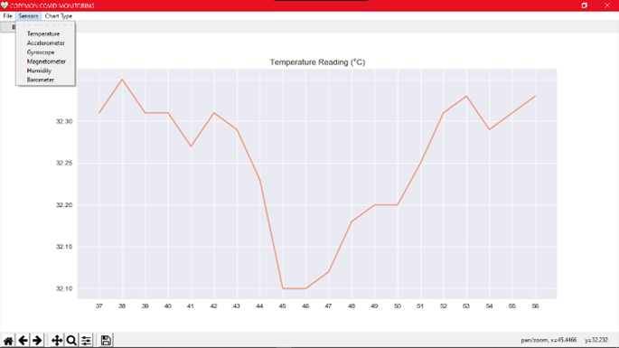
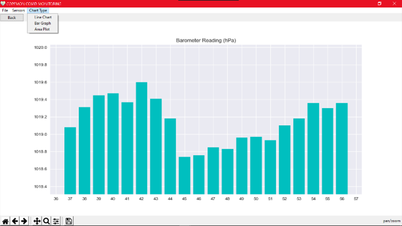
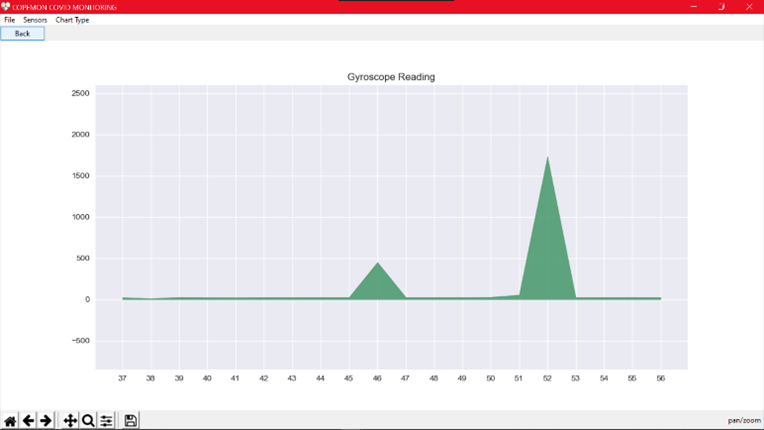
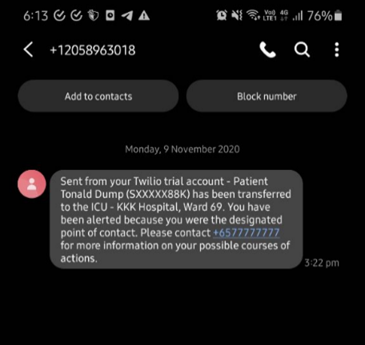

# COPEMON: A MedTech IoT Software on the STM32 MCU

## Introduction and Objectives
This project aims to design a system, referred to as COPEMON, that enhances the monitoring of COVID patients, particularly the elderly patients. COPEMON has 2 operation modes – Healthy and Intensive Care Modes and if certain conditions are met, it will transmit data every 10 seconds to a server called Chip Associated Cloud Unit (CHIPACU), a terminal program running on the PC that communicates with the STM32 chip. Healthcare providers will then be alerted through the server and take the necessary course of actions to ensure the health and safety of the patients. 

The monitoring system is implemented using STM32L475vg board. The board is assumed as a larger prototype version of COPEMON, with sensors namely accelerometer, magnetometer, pressure sensor, temperature sensor, humidity sensor and gyroscope to monitor the patient’s conditions. 

The objectives of the project are for us to: 
* be able to apply system design approaches, such as using flowcharts, to design embedded applications
* understand the interfaces between microcontrollers and peripherals
* have the ability to develop C embedded programming controller-based applications

## Interrupt Flowchart


## Interrupt Flowchart


## Detailed Implementation
### Helper libraries initialisation and variable definitions
Apart from including the necessary header files for the various sensors, their respective peripheral initialisation functions from the BSP library must be evoked as well. This is to allow the sensor readings to be obtained using the predefined functions such as `BSP_TSENSOR_ReadTemp()` to retrieve temperature readings. Many variables were also initialised, such as counters, flags for sensor warnings, and char arrays to represent strings. 

### Interrupt Handling
Interrupt signals are all handled at the backend by NVIC. Hence, our job was to simply define the responses to these signals using their respective callback functions. In our case, because our two interrupt signals from the pushbutton and the accelerometer occupy EXTI lines 10 to 15, both their signals were handled by one callback function. Hence, conditionals were required to determine the correct pin when a signal was generated. To detect double button presses within a second, the btn_count flag was introduced while the time differences were handled by SYSTICK interrupts. For the first press, btn_count was initially 0, hence, that current SYSTICK value was saved before setting btn_count to 1. For the second press, since btn_count is now 1, we now check the time difference between the first and second presses by checking if the new SYSTICK value minus the original is less than 1 second. If it is, a double press was detected, otherwise, the btn_count resets to 0. 

```C
if (btn_count == 0) {
    tickstart = HAL_GetTick();
    btn_count = 1;
} else {
    if ((HAL_GetTick() - tickstart) < btn_wait) { // double press = trigger icu mode
        icu_mode = 1; // trigger icu mode if double press
    }
    btn_count = 0;
}
```

### Accelerometer Interrupt Configuration
Skeleton codes to enable the GPIO connection with the STM board for the accelerometer LSM6DSL was obtained from the built-in `BSP_PB_Init()` function which sets up the port PD11 using `HAL_GPIO_Init()` and the NVIC set priority and enable IRQ configurations. Conversely, the function `SENSOR_IO_Write()` was used to write to LSM6DSL’s registers directly in order to activate functions specific to the device. Information on the device’s address, the device registers’ addresses and the specific bits to set or reset were all obtained from the device’s datasheet. In our case, the FREE_FALL interrupt signal was enabled to detect falling patients when their acceleration exceeds 500mg within a short duration of time defined by the device. These were achieved by the following code, with their respective functions written in the comments. 

```C
SENSOR_IO_Write(LSM6DSL_ACC_GYRO_I2C_ADDRESS_LOW, LSM6DSL_ACC_GYRO_CTRL1_XL, 0x60); // turn on accelerometer
SENSOR_IO_Write(LSM6DSL_ACC_GYRO_I2C_ADDRESS_LOW, LSM6DSL_ACC_GYRO_TAP_CFG1, 0x80); // enable basic interrupts
SENSOR_IO_Write(LSM6DSL_ACC_GYRO_I2C_ADDRESS_LOW, LSM6DSL_ACC_GYRO_FREE_FALL, 0xff); // set free fall threshold and duration to be highest setting at 500mg to limit false positives
SENSOR_IO_Write(LSM6DSL_ACC_GYRO_I2C_ADDRESS_LOW, LSM6DSL_ACC_GYRO_MD1_CFG, 0x10); // enable routing of free fall event detection
```

### Program Flow & Logic
In the main while loop, there are a few conditionals to determine the reactions. However, overall, a delay of 250ms caused by HAL_Delay(250) occurs after each iteration since it is the lowest common factor to achieve other timing requirements such as 1 second and 10 seconds. 

### Program Flow & Logic: LED Blink
The LED blinks at 2Hz, which is twice a second, and only if there are sensor warnings triggered. Hence, we simply check all the warning flags in an OR-ed fashion. The LED is set to toggle on and off every 250ms using `HAL_GPIO_TogglePin()` through Port B Pin 14 as the inputs. 

### Program Flow & Logic: Healthy & ICU Mode Messages
Checking the flag icu_mode allows the current mode to be determined. If in healthy mode, only the message “Entering Healthy Mode” is sent. It is also set to send only once after changing modes by checking another flag, msg_mode_flag. The flag will invert after the corresponding mode message is sent. In healthy mode, the condition is to check if it is 0 while in ICU mode, it checks if it is 1. 

```C
if (!icu_mode) {
    char msg_mode[] = "Entering Healthy Mode\r\n\n";
    if (!msg_mode_flag) HAL_UART_Transmit(&huart1, (uint8_t*)msg_mode, strlen(msg_mode), 0xFFFF);
    msg_mode_flag = 1;
} else {
    char msg_mode[] = "\nEntering Intensive Care Mode\r\n\n";
    if (msg_mode_flag) HAL_UART_Transmit(&huart1, (uint8_t*)msg_mode, strlen(msg_mode), 0xFFFF);
    msg_mode_flag = 0;
}
```

### Program Flow & Logic: Sensor Readings and Warnings
In ICU Mode, all sensor data are retrieved every 1 second except for temperature and accelerometer readings, which are retrieved every 1 second regardless of mode. After retrieving the data, they are checked against their corresponding threshold values to see if a warning should be generated. For temperature threshold, it was set to 37.8C, which signifies a fever while the other threshold levels are set to reasonable values that do not trigger too easily or too difficult. Both gyroscope and magnetometer values are combined by summing the square of the XYZ values before rooting it to obtain the magnitude in every direction. For magnetometer, an original value was saved when the device powers on to signify the original lying position of the patient. Every new reading then checks against the original to see if the change is big enough to determine if the patient is in an abnormal orientation. The accelerometer's thresholds and warnings are generated through interrupt signals. 

### Program Flow & Logic: Transmitting Data
Finally, every 10 seconds, warnings and sensor readings are pushed through UART to USB to Tera Term. Warnings are only generated if their corresponding flags are on while the sensor readings are only generated if in ICU mode. An internal counter, icu_timer, counts the number of times the sensor readings are sent. 

## Enhancement: COPEMON.EXE
### Introduction
Reading raw sensor values in text through a console is extremely hard to visualise and understand because it is hard to reference previous data to draw context. Moreover, when all the values are given in huge chunks at one go, it is hard to sieve out the necessary information. Hence, visualising data is crucial in every field, especially in our current times, where there is often too much data rather than too little. Visualising data also allows further insights to be obtained using statistical methods and further techniques such as machine learning to draw conclusions. Finally, automating alert systems through SMS and other forms of communication allows for a more efficient system so that frontline workers can focus on other aspects that are harder to automate. 

### Program Overview
To allow for a user-friendly way of understanding data, everything was wrapped in a GUI using Python’s Tkinter library. Periodic data obtained from the sensor readings on the STM board are fed to the PC or server serially through the USB cable. The data is then read periodically using Python’s Serial library before being saved into a text file in csv format to allow data to be parsed easily. This allows the raw data to be utilised in other areas such as analytics that are beyond the scope of this software. In a separate loop, the text file is being read and parsed to allow charting using Matplotlib and its animation function which allows for live visualisations and selection of sensor data. Both loops are run concurrently using two different threads. Additionally, SMS alerts are achieved using Twilio’s API. Finally, all the Python code is compiled into an .exe file using PyInstaller for portability. 

### Graphical User Interface (GUI)
<p align="middle">
  
  
</p>

The home page consists of 4 buttons as well as the patient’s brief information. The patient’s details are ideally retrieved from a database but for demonstration purposes, they were hardcoded. The Exit button quits the program while the Reset button clears all existing data from the text file that stores the raw sensor data. At the top of every page, there are also additional options to pause or unpause the graph updates, to change the sensor chart and also the chart style. 
The Patient Info page, again, is hardcoded for demonstration purposes. At the bottom there is an “Alert NOK” button that immediately sends an SMS to the designated NOK to manually alert them that the patient has been transferred to the ICU. 

### Live Data Visualisation and NOK SMS Alert System
<p align="middle">
  
  
  
</p>

In the Monitor page, the charts will be updated live when new data is obtained when in ICU mode. Moreover, on the menu bar on top, one can select the different sensor readings and the chart type. One can also pause or unpause the live updates to allow for chart navigation such as zooms and pans from the buttons on the bottom left as well as export the visualisation as an image using the save button. Lastly, SMS alerts will also be sent automatically to the designated point of contact or NOK when the ICU mode is triggered from the STM board, detailing information such as name, ID, ward number and further information. This can be expanded to include other details or different messages for different scenarios to enable a fully automated alert system or even a reply bot all with the help of Twilio’s API. 

<p align="middle">
  
</p>

## Problems Encountered and Solutions Proposed
One potential problem is the accuracy of time. Accurate timing was obtained using SYSTICK timing in the EXTI handlers, since interrupts should not be “paused” or bogged down by delays. However, we chose to use `HAL_Delay()` in the main loop, which assumes that every other lines of code execute in negligible amounts of time. However, this is most likely not the case, causing small amounts of time lag. Ideally, `HAL_GetTick()` should also be used in the main loop to calculate time differences and allow other parts of the program to continue running when the time difference is not equals to the desired delay such as 1 second or 10 seconds. However, because this would require multiple layers of while loop checking the current SYSTICK time against the original SYSTICK time, the code would end up fairly convoluted. Hence, the decision was made to ignore the tiny amounts of time lag generated when running other parts of the code since overall, the lag is largely unnoticeable. 